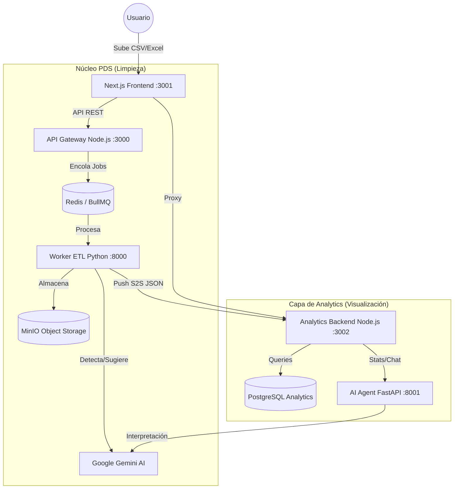

# 🚀 PymesDataStrategy — Plataforma SaaS Inteligente de Datos

> **Proyecto de Grado GIIS SW-005 — Fundación Universitaria Compensar**
> Solución Integral: Limpieza ETL con IA (HITL) + Visualización de Negocio + Asistente Gemini.


---

## 📋 Descripción General

**PymesDataStrategy** es un ecosistema SaaS de extremo a extremo diseñado para transformar el caos de datos de las pequeñas y medianas empresas en **decisiones estratégicas**. 

La plataforma unifica dos mundos:
1.  **Limpieza Robusta (ETL):** Un pipeline que detecta anomalías, outliers y errores mediante IA, permitiendo validación humana (**Human-in-the-Loop**).
2.  **Visualización Inteligente:** Un dashboard automático que genera KPIs y gráficas de negocio al instante, complementado con un **Chatbot IA** que responde preguntas sobre los datos.

---

## 🏗️ Arquitectura del Sistema (Monorepo)



---

## ✅ Funcionalidades Implementadas

### 🔄 Módulo ETL & HITL (Limpieza)
- **Ingesta Flexible:** Soporte para archivos `.csv`, `.xls`, `.xlsx` de hasta **50MB**.
- **Detección Automática:** Identificación de `MISSING_VALUE`, `OUTLIERS` (Z-score > 3), duplicados y errores de formato.
- **Sugerencias AI:** Gemini genera propuestas de corrección basadas en el contexto real de los datos.
- **Human-in-the-Loop:** Interfaz interactiva para aprobar, corregir manualmente o eliminar filas con anomalías.
- **NL Edit:** Permite escribir instrucciones en lenguaje natural (ej: *"reemplaza nulos por la media del sector"*) para aplicar transformaciones.

### 📊 Módulo Analytics (Dashboard)
- **Motor Adaptativo:** Detecta automáticamente el tipo de negocio (Ventas, Salud, RRHH, Finanzas, etc.) y genera KPIs específicos.
- **Gráficas Inteligentes:** 7 tipos de visualizaciones dinámicas (Line, Bar, Pie, Radar, Scatter) generadas con lógica de negocio.
- **Tendencias Históricas:** Lógica de detección temporal que agrupa datos por mes o **año** automáticamente.
- **Exportación PDF:** Generación de reportes ejecutivos con capturas reales de las gráficas y conclusiones de IA.

### 🤖 Asistente de IA (Chatbot)
- **Consultas Naturales:** Pregunta a tus datos: *"¿Cuál fue el mes con mejores ventas?"* o *"¿Hay alguna anomalía en los salarios?"*.
- **Análisis por Gráfica:** Botón dedicado para que la IA analice y explique el significado de cada gráfico individualmente.

---

## 🛠️ Stack Tecnológico

| Capa | Tecnologías |
|---|---|
| **Frontend** | Next.js 15 (App Router), React 19, Tailwind CSS v4, Zustand, React Query, Chart.js. |
| **API Gateway** | Node.js, Express, TypeScript, Prisma ORM, BullMQ, JWT. |
| **Worker ETL** | Python 3.12, FastAPI, **Polars** (Procesamiento de alto rendimiento), SQLAlchemy. |
| **Agente IA** | Python, FastAPI, **scikit-learn** (Regresión, Clustering), Pandas, Google GenAI. |
| **Infraestructura** | Docker, PostgreSQL (x2), Redis, MinIO (S3-Compatible). |

---

## 🗄️ Estructura de Datos

### 1. Schema de Operación (Prisma)
- **User:** Gestión de cuentas y roles.
- **Dataset:** Metadatos de archivos cargados, estado (`PENDING`, `PROCESSING`, `READY`) y keys de MinIO.
- **Anomaly:** Registro detallado de errores detectados (columna, fila, tipo, valor original).
- **Decision:** Almacena la acción tomada por el humano (aprobado/corregido) y la representación intermedia (IR).
- **TransformationJob:** Trazabilidad de los procesos en cola.

### 2. Schema de Analytics (SQL)
- **Empresas/Users:** Contexto organizacional.
- **Registros Datos:** Almacenamiento optimizado en **JSONB** con índices GIN para permitir consultas dinámicas sobre cualquier estructura de CSV.
- **Chatbot Logs:** Historial de interacciones y consumo de tokens.

---

## 📁 Estructura del Proyecto

```
PymesDataStrategy-Monorepo/
├── frontend/                # Interfaz Next.js 15
│   ├── app/                 # App Router (Dashboard, Landing, Auth)
│   ├── components/          # UI Neo-Brutalista y features integradas
│   └── hooks/api/           # Integración con Backend y Proxy Analytics
├── backend/                 # Infraestructura de Limpieza
│   ├── api/                 # API Gateway (TypeScript + Hexagonal)
│   ├── worker/              # ETL Processor (Python + Polars)
│   └── prisma/              # Modelado de base de datos HITL
├── services/
│   └── dashboard-pymes/     # Capa de Analítica (Deconstruida)
│       ├── backend/         # Motor de KPIs y Stats (Node.js)
│       └── agent/           # Cerebro estadístico y Gemini (Python)
├── docs/                    # Documentación técnica y logs
├── docker-compose.yml       # Orquestador de 9 servicios
└── README.md                # Este archivo
```

---

## 🚀 Guía de Instalación (Inicio Rápido)

### 1. Prerrequisitos
- Docker Desktop instalado.
- Puertos libres: 3000, 3001, 3002, 5432, 6379, 8000, 8001, 9000, 9001.

### 2. Clonar y Configurar
```bash
git clone https://github.com/jcgmU/PymesDataStrategy-Monorepo.git
cd PymesDataStrategy-Monorepo
```

Crea un archivo `.env` en `backend/` (usa `.env.example` como guía).
**Obligatorio:**
- `GEMINI_API_KEY`: Consíguela en [Google AI Studio](https://aistudio.google.com/app/apikey).
- `NEXTAUTH_SECRET`: Generada con `openssl rand -base64 32`.

### 3. Despliegue con Docker
```bash
cd backend
docker compose up --build -d
```

### 4. Acceso
- **Plataforma:** [http://localhost:3001](http://localhost:3001)
- **API Docs:** [http://localhost:3000/api/docs](http://localhost:3000/api/docs)

---

## 📄 Créditos y Licencia

Este monorepo integra el trabajo coordinado de:
- **Limpieza de Datos:** PymesDataStrategy Core.
- **Motor Analytics:** DashboardPYMES (Integración modular).

Licencia **MIT** — Proyecto Académico Fundación Universitaria Compensar.
